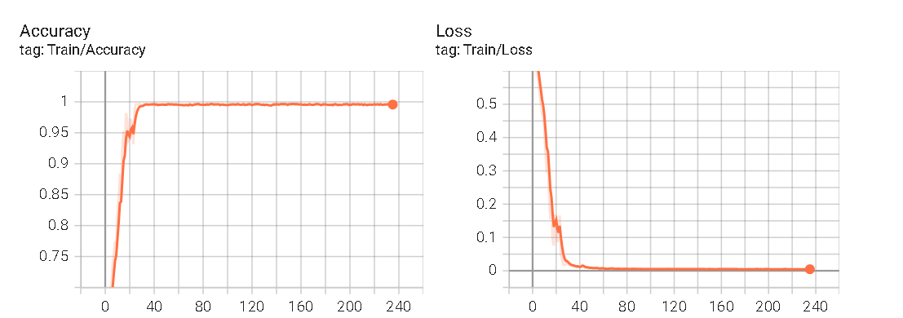

- [x] 多任务resunet
- [x] 多任务smlpresunet
- [x] 多任务unet
- [x] 多任务smlpunet
- [x] 捣乱>_<
- [x] 单任务resnet
- [x] 单任务resunet
- [x] 单任务unet
- [x] 单任务train
- [x] 多任务train

# 训练

## 单任务

### 单任务resnet

学习率0.0001

Epoch 235/300: 
train Loss: 0.0045 - Accuracy: 0.9960 - Precision: 0.9960 - Recall: 0.9960 - F1 Score: 0.9960

val Loss: 1.3454 - val Accuracy: 0.7545 - val Precision: 0.7535 - val Recall: 0.7545 - val F1 Score: 0.7540

Epoch 236/300
train Loss: 0.0047 - Accuracy: 0.9949 - Precision: 0.9950 - Recall: 0.9949 - F1 Score: 0.9949

val Loss: 1.3496 - val Accuracy: 0.7545 - val Precision: 0.7535 - val Recall: 0.7545 - val F1 Score: 0.7540

过拟合了，epoch20的时候val就75了，泛化能力较差

adam. 0.0001 数据增强

Epoch 136/300:
train Loss: 0.0608 - Accuracy: 0.9798 - Precision: 0.9798 - Recall: 0.9798 - F1 Score: 0.9798

val Loss: 1.2951 - val Accuracy: 0.6909 - val Precision: 0.7284 - val Recall: 0.6909 - val F1 Score: 0.6950

Epoch 137/300:
train Loss: 0.0421 - Accuracy: 0.9838 - Precision: 0.9839 - Recall: 0.9838 - F1 Score: 0.9838

val Loss: 1.3343 - val Accuracy: 0.7545 - val Precision: 0.7557 - val Recall: 0.7545 - val F1 Score: 0.7551

Epoch 138/300: 
train Loss: 0.1282 - Accuracy: 0.9485 - Precision: 0.9485 - Recall: 0.9485 - F1 Score: 0.9485

val Loss: 1.1010 - val Accuracy: 0.7182 - val Precision: 0.7195 - val Recall: 0.7182 - val F1 Score: 0.7188

Epoch 139/300: 100
train Loss: 0.1017 - Accuracy: 0.9606 - Precision: 0.9606 - Recall: 0.9606 - F1 Score: 0.9606
val Loss: 1.0863 - val Accuracy: 0.7273 - val Precision: 0.7300 - val Recall: 0.7273 - val F1 Score: 0.7284

#### 改线性层

#### 数据增强，改线性层

#### 加上dropout

#### dropout，改线性层

### 单任务resunet

### 单任务unet

## 多任务

### 多任务resunet

### 多任务smlpresunet

### 多任务unet

### 多任务smlpunet

